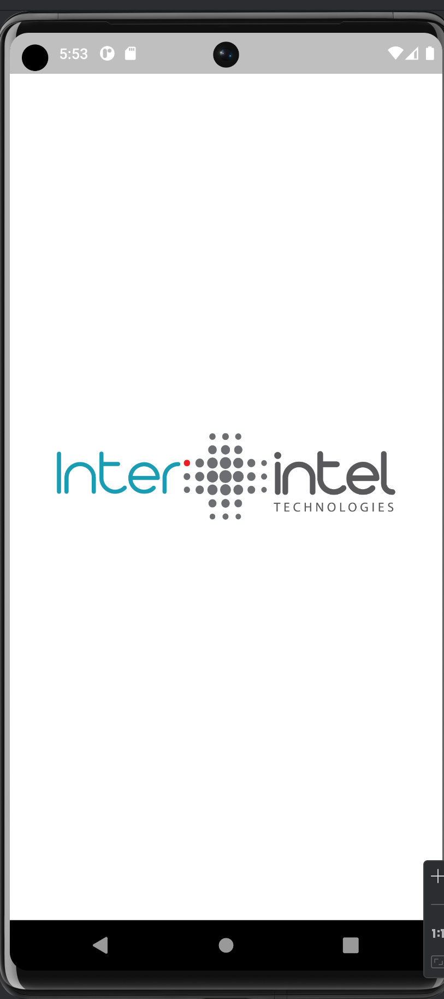
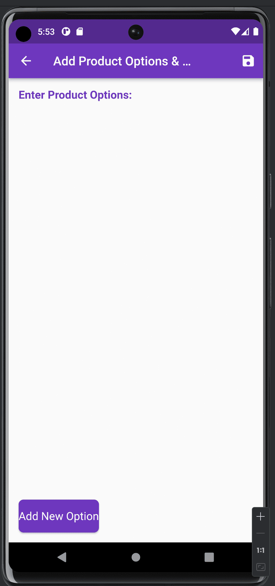
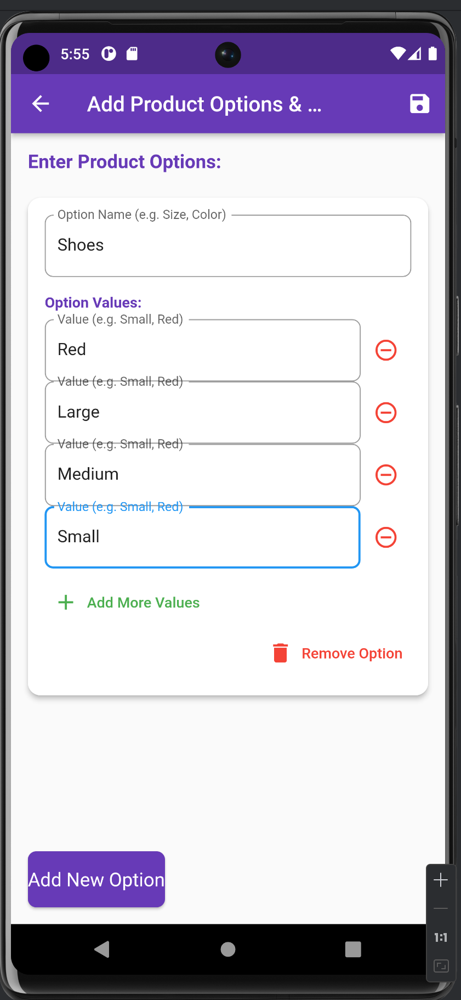
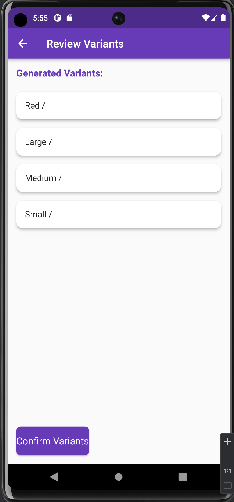

# interintel

A new Flutter project.

## Getting Started

This project is a starting point for a Flutter application.

A few resources to get you started if this is your first Flutter project:

- [Lab: Write your first Flutter app](https://docs.flutter.dev/get-started/codelab)
- [Cookbook: Useful Flutter samples](https://docs.flutter.dev/cookbook)

For help getting started with Flutter development, view the
[online documentation](https://docs.flutter.dev/), which offers tutorials,
samples, guidance on mobile development, and a full API reference.

# InterIntel Flutter Interview Test.

## Android Developer Pre-screening test

## Description

The task is then to simply develop a
Flutter app that allows a user to add product variants like shown in the video. The focus is on the
product options and variants so you can safely assume a product has already been added. Also,
consuming a web service is out of scope. We just need the UI (User Interface) and logic for capturing
product option names, values, and logic for generating the variants when a user is done entering the
product options.

## Key Features and Functionalities:
### 1. Home Screen:

    - A landing page or dashboard where users can view the list of products (assuming the product is already added).
    - Button to "Add Product Options & Variants."

### 2. Add Product Options Screen:
    - Product Name (Display only): Display the name of the selected product (this can be a static label for now).
    - Add Option Button: A button to add multiple options for the product.
  ## Option Fields: Each product option will have:
- An input field for the option name (e.g., "Size", "Color").
-  Multiple input fields for option values (e.g., "Small, Medium, Large" for Size or "Red, Blue, Green" for Color).
- A button to add another value to the option (for example, adding more sizes or colors).

### 3. Generate Variants Logic:

    - Once options are added, generate all possible variants using a combinatorial approach.

  ### Example:
- If you have the option "Size" with values [Small, Medium, Large] and the option "Color" with values [Red, Blue], the variants generated would be:
 - Small Red
 - Small Blue
 - Medium Red
 - Medium Blue
 - Large Red
 - Large Blue

## Review Variants Screen:

    - A screen to show all the generated variants.
    - Each variant should be listed clearly, and there should be an option to remove a variant if needed.

 ## Achievments
- Created a flexible system for adding product options (like size or color) and multiple values for each option (e.g., Small, Medium, Large for size).
- Users can dynamically add or remove both options and their respective values with real-time UI updates.
- Automatically generates combinations of product variants based on the user input of options and values.
- Displays the generated product variants in a list for review, ensuring the user can verify combinations before confirming.
- Splash screen animation   

## Modularization Structure 🔥
# Root Project
    .
    │   
    |
    └── lib                        # Name of module (default from Flutter).
        ├── models                 # Main models for task.
        ├── presentations          # Activity/View layer
        ├── theme                  # App styling themes.
        ├── widget                 # Styles for app.

## How to run the App
1. Clone this project.
2. Open with your favorite tools editor.

## Thank you InterIntel
I'd like to thank **InterIntel**, and *every single individual* that helped in bringing this learning experience. Thank you!

## Project Demo

